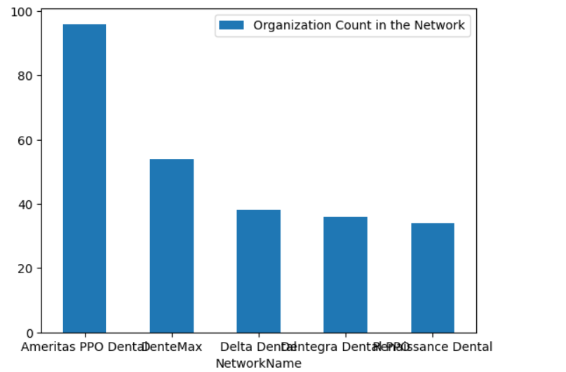
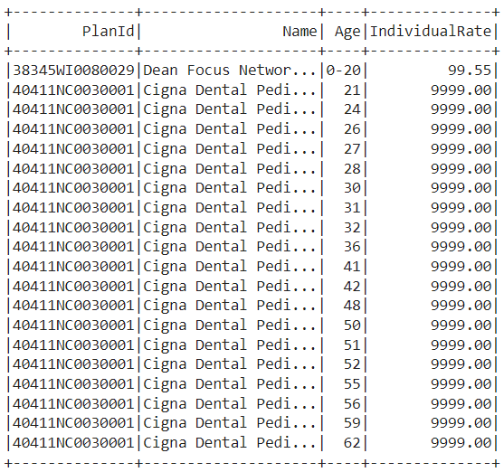

# Health Insurance

#### Project Summary
This project aims to gather data of health insurance plans and analyze it through many aspects, It aims to answer questions like:
- What are the top 5 Networks that have the biggest Number of organizations
- The Plans with the highest Individual Rate for Each Age for Year 2023
- Average Individual Rate changes over years 2016 to 2023 grouped by Age
And many more analytical questions.

The project follows the following steps:
* Step 1: Gather Data
* Step 2: Explore and Assess the Data
* Step 3: Define the Data Model
* Step 4: Data Analysis
* Step 5: Performance Optimization

### Step 1 
#### Data Gathering

The project depends the Health Insurance Data released by [Centers for Medicare & Medicaid Services](https://www.cms.gov/marketplace/resources/data/public-use-files).

The Public Use Files (PUFs) contain data of organizations, networks, plans, plans' variants and the rates for individuals and family from year 2014 to year 2023.

### Step 2
#### Data Exploring and Preprocessing
More details can be found in the notebook , Preprocessing tasks were like removing redundant data , removing raws with corrupted Id field.

### Step 3 
#### Data Model

#### Data Fields' Description

### Step 4
#### Data Analysis
The Top 5 Networks having the Biggest number of organization included in them.

This Table shows the plans with the highest individual rate for each age for the year 2023. It shows that cigna Dental Plan has the highest individual rate for almost all of the ages.

### Step 5 
#### Performance Optimization

- RDDs VS DataFrames
  In this PySpark application we used DataFrames instead of using RDDs, This is an optimization because RDDs have no built-in optimization while DataFrames benefit from Spark's built-in optimizations, including the Catalyst optimizer and Tungsten execution engine. These optimizations enable DataFrames to offer better performance and resource efficiency compared to RDDs.
- Cashing and Presisting DataFrames
  The `cache()` method caches the DataFrame in memory, while the `persist()` method allows you to specify a storage level for the DataFrame. By default, the `persist()` method stores the DataFrame in memory, but you can also store it on disk or in a combination of memory and disk.

